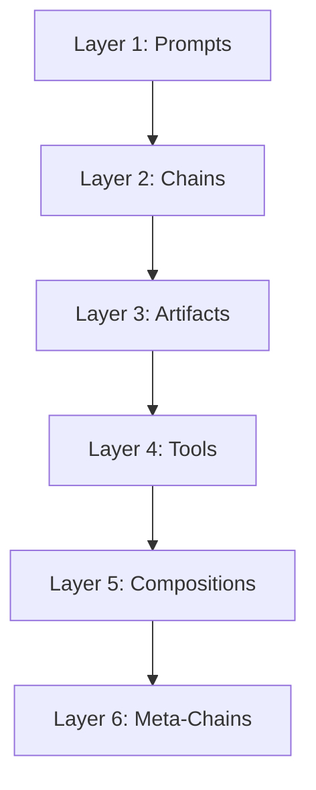

# System Architecture

The Prompt Chaining Framework is built on a 6-layer architecture designed to move from simple prompts to self-improving AI systems.

## Overview

---

## Layer 1: Prompts
**The Atomic Unit**

At the base level, we have individual prompts sent to an LLM.
- **Input**: Context variables (`{{topic}}`)
- **Output**: Raw text response
- **State**: Stateless (single shot)

---

## Layer 2: Chains (`MinimalChainable`)
**Sequential Reasoning**

Chains connect prompts in a sequence, where each step can reference outputs from previous steps.
- **Mechanism**: `{{output[-1]}}` references
- **Capability**: Decompose → Analyze → Synthesize
- **State**: Ephemeral (exists only during execution)

**Example:**
1. "List components of X"
2. "Explain {{output[-1]}}"

---

## Layer 3: Artifacts (`ArtifactStore`)
**Persistent Knowledge**

Artifacts turn ephemeral chain outputs into persistent, addressable knowledge.
- **Mechanism**: `{{artifact:topic:step}}` references
- **Storage**: JSON files on disk (`artifacts/`)
- **Capability**: Zero-cost reuse of prior work
- **State**: Persistent (survives across runs)

**Example:**
- Run A creates `artifacts/solar_system/planets.json`
- Run B uses `{{artifact:solar_system:planets}}` without re-generating it

---

## Layer 4: Tools
**Reusable Logic**

Tools are Python scripts that wrap chains into specific functions.
- **Mechanism**: Python modules (`tools/learning/concept_simplifier.py`)
- **Capability**: Specialized tasks (Simplification, Connection, Content Gen)
- **Interface**: CLI arguments → Chain execution → Artifact creation

**Examples:**
- `concept_simplifier`: Educational breakdown
- `ms_content_tools`: Blog post generation

---

## Layer 5: Compositions (`ChainComposer`)
**Orchestration**

Compositions coordinate multiple tools and chains into complex workflows.
- **Mechanism**: `ChainComposer` and `ChainRecipe`
- **Capability**: Multi-tool workflows, dependency management
- **Logic**: "Run Tool A, then Tool B, then synthesize results"

**Example:**
- **Curriculum Builder**:
    1. Run `concept_simplifier` on 3 topics
    2. Run `subject_connector` between them
    3. Synthesize into a syllabus

---

## Layer 6: Meta-Chains (`MetaChainGenerator`)
**Self-Improvement**

Meta-chains are chains that design other chains.
- **Mechanism**: `MetaChainGenerator`
- **Capability**: Goal → Optimal Chain Design
- **Logic**: "Analyze the user's goal, determine the best cognitive moves, and generate the prompts to achieve it."

**Example:**
- User: "Help me analyze this business plan"
- Meta-Chain: Designs a custom 4-step chain (Critique → Market Fit → Financials → Summary) and executes it.

---

## Data Flow

1. **User Input** → Enters at any layer (usually Tool or Meta)
2. **Execution** → Flows down to Chains/Prompts
3. **Knowledge** → Flows up as Artifacts
4. **Improvement** → Meta layer optimizes lower layers

## Key Components

- **`chain.py`**: Core chaining logic
- **`artifact_store.py`**: Knowledge management
- **`chain_composer.py`**: Workflow orchestration
- **`meta_chain_generator.py`**: Automated design
- **`main.py`**: Model configuration (OpenRouter/Claude)
