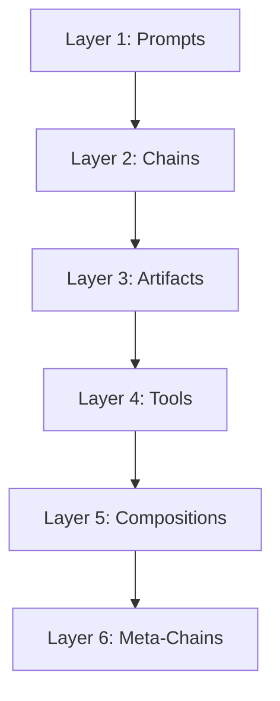

# System Architecture

The Prompt Chaining Framework is built on a 6-layer architecture designed to move from simple prompts to self-improving AI systems.

## Overview

## Design Philosophy
**Local-First, Single-User, High-Capability**

This project is built for a single local user ("The Builder").
- **No Auth**: We assume you are running this locally. No logins, no passwords.
- **No Rate Limiting**: You are the only user. We don't artificially throttle you.
- **Flat & Simple**: We prefer simple scripts and clean code over complex enterprise abstractions.
- **Power over Safety**: We expose raw power (CLI, direct file access) rather than sandboxing everything.

---

## Layer 1: Prompts
**The Atomic Unit**

At the base level, we have individual prompts sent to an LLM.
- **Input**: Context variables (`{{topic}}`)
- **Output**: Raw text response
- **State**: Stateless (single shot)

---

## Layer 2: Chains (`MinimalChainable`)
**Sequential Reasoning**

Chains connect prompts in a sequence, where each step can reference outputs from previous steps.
- **Mechanism**: `{{output[-1]}}` references
- **Capability**: Decompose → Analyze → Synthesize
- **State**: Ephemeral (exists only during execution)

**Example:**
1. "List components of X"
2. "Explain {{output[-1]}}"

---

## Layer 3: Artifacts (`ArtifactStore`)
**Persistent Knowledge**

Artifacts turn ephemeral chain outputs into persistent, addressable knowledge. Every chain step creates reusable artifacts that future chains can reference.

### Core Mechanism
- **Mechanism**: `{{artifact:topic:step}}` references
- **Storage**: JSON files in `artifacts/` directory
- **Capability**: Zero-cost reuse of prior work

### How it works
1. **Save**: `artifact_store.save(topic="ML", step="components", data={...})`
2. **Query**: `artifact_store.query("*:components")`
3. **Reuse**: Prompts can reference `{{artifact:topic:step}}`, which injects the JSON data directly into the context.

This transforms the system from ephemeral execution to a **growing knowledge graph**.

---

## Layer 4: Tools
**Reusable Logic**

Tools are Python scripts that wrap chains into specific functions.
- **Mechanism**: Python modules (`tools/learning/concept_simplifier.py`)
- **Capability**: Specialized tasks (Simplification, Connection, Content Gen)
- **Interface**: CLI arguments → Chain execution → Artifact creation

**Examples:**
- `concept_simplifier.py`: Educational breakdown (Decompose → Analogize → Synthesize)
- `ms_content_tools.py`: Blog post generation pipeline

---

## Layer 5: Compositions (`ChainComposer`)
**Orchestration**

Compositions coordinate multiple tools and chains into complex workflows. It allows for "Chains of Chains".

### Core Components
- **`ChainStep`**: A single step (can be a Tool, a custom Chain, or a Synthesis step).
- **`ChainComposer`**: The engine that executes a list of steps, passing artifacts between them.
- **`ChainRecipe`**: Pre-built composition patterns (e.g., `concept_comparison`, `learning_curriculum`).

### Capabilities
1. **Multi-Tool Workflows**: Run Tool A, then Tool B, then synthesize.
2. **Knowledge Graph Building**: Systematically analyze domains and connect them.
3. **Advanced Synthesis**: Query all artifacts matching a pattern (`*:components`) and synthesize insights across topics.

**Example: Concept Comparison Recipe**
1. Run `concept_simplifier` on Topic A
2. Run `concept_simplifier` on Topic B
3. Run `subject_connector` to find links
4. Synthesize all artifacts into a comparison

---

## Layer 6: Meta-Chains (`MetaChainGenerator`)
**Self-Improvement**

Meta-chains are chains that design other chains. The system analyzes a goal and designs the optimal cognitive process to achieve it.

### How it works
1. **User Goal**: "Teach recursion using cooking analogies"
2. **Analysis**: Meta-chain analyzes the goal to determine required "Cognitive Moves" (e.g., Decompose, Analogize, Exemplify).
3. **Design**: Generates a `ChainDesign` object containing the specific prompts and sequence.
4. **Execution**: The designed chain is executed to produce the result.

### Cognitive Moves
The system uses a library of "thinking primitives":
- `decompose`, `analogize`, `synthesize`, `connect`, `critique`, `exemplify`, `historicize`, `problematize`, `apply`, `compare`.

This represents **AI-assisted AI engineering**—the system designs itself.

---

## Framework Enhancements

Beyond the layers, the framework includes specialized modules for advanced reasoning and validation.

### 1. Natural Reasoning Patterns (`natural_reasoning.py`)
Formalizes expert reasoning patterns as reusable templates:
- **Scientific Method**: Observation → Hypothesis → Prediction → Experiment → Conclusion.
- **Socratic Dialogue**: Systematic questioning to refine beliefs.
- **Design Thinking**: Empathize → Define → Ideate → Prototype → Test.
- **Judicial Reasoning**: Facts + Principles + Precedent = Judgment.
- **5 Whys**: Root cause analysis.

### 2. Adversarial Chains (`adversarial_chains.py`)
Uses conflict and opposition to reveal truth (dialectical reasoning):
- **Red Team vs Blue Team**: Attack vs Defense vs Judge.
- **Dialectical Synthesis**: Thesis → Antithesis → Synthesis.
- **Adversarial Socratic**: Aggressive stress-testing of claims.

### 3. Emergence Measurement (`emergence_measurement.py`)
Scientifically checks if chains outperform single prompts (`baseline`).
- **Method**: Runs Topic X through a Chain and a Baseline Prompt.
- **Evaluation**: An LLM Judge scores both outputs on: Novelty, Depth, Coherence, Pedagogical value, Actionability.
- **Result**: Data-backed verdict on "Emergence"—whether the chain unlocked insights the single prompt missed.

---

## Engineering Standards

### 1. DRY Tooling Architecture
All backend tools reuse core logic to ensure consistency and maintainability:
- **Shared Utilities**: `tools/tool_utils.py` centralizes common tasks.
- **Unified Output**: `save_chain_output` standardizes how JSON traces, Markdown logs, and Artifacts are persisted. This ensures every tool immediately supports the full visualization suite.

### 2. Component-Based Frontend
The Web UI uses a modular architecture for reasoning patterns:
- **Pattern Registry**: `PatternLauncher.jsx` acts as a dispatcher.
- **Isolated Feeds**: Each reasoning pattern (e.g., `SocraticFeed`, `ScientificMethodFeed`) is a standalone component in `web/src/components/patterns/`.
- **Shared Rendering**: Common display logic is extracted to `utils.js`.

---

## Data Flow Summary

1. **User Input** → Enters at any layer (Tool, Composer, or Meta-Chain)
2. **Orchestration** → Decomposed into Steps (Layer 5)
3. **Design** → Steps may be designed by Meta-Chain (Layer 6)
4. **Execution** → Steps run as Chains (Layer 2) of Prompts (Layer 1)
5. **Persistence** → Outputs saved as Artifacts (Layer 3)
6. **Improvement** → Future runs reuse Artifacts
